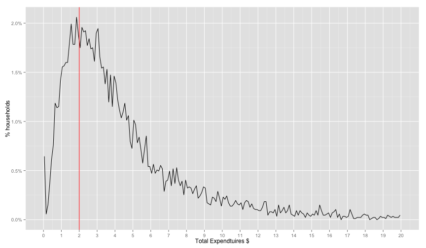
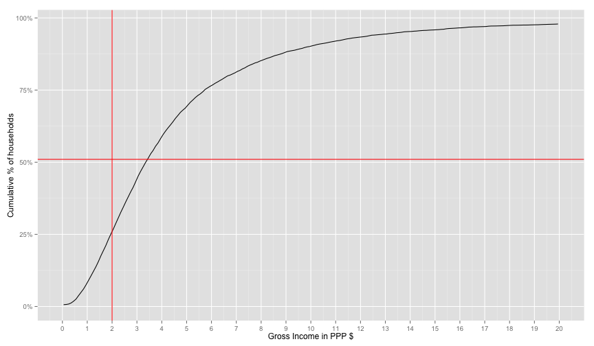
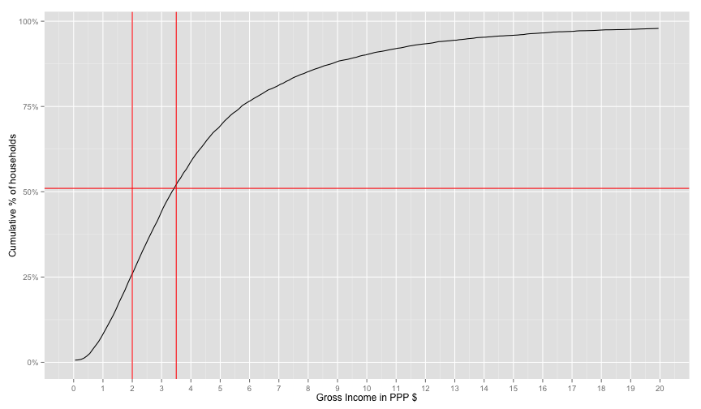

# Living Standards Surveys and Poverty Assessments


### Expected Output of This Report
We'll explore a pipeline of taking a dataset, performing a simple exploratory analysis
and using some simple classifiers to compare performance of the different classifiers
via known metrics. We'll although try to have a generic and *simple* way to add performance metrics
that weren't included in the original report as well as classifiers.


### Data Sources and Notes
LSMS (Living Standards Measurements Study) has huge datasets from many countries starting from 1980.
ofc, the LSMS doesn't include all population, but it's sampled in a way to ensure 
that the sample is representative, read [here](http://econ.worldbank.org/WBSITE/EXTERNAL/EXTDEC/EXTRESEARCH/EXTLSMS/0,,contentMDK:21556594~menuPK:4196884~pagePK:64168445~piPK:64168309~theSitePK:3358997~isCURL:Y,00.html). 

First to get an understating of how this survey/data looks like, I posted a public note [here](https://www.evernote.com/l/AMMwZHCpOoxBUIFNQIzmeDLW2TirSX1U0qg).

Unfortunately, because surveys are country specific, only recently were 
the efforts of harmonizing those datasets started. This variance resulted in many
challenges for comparative studies between countries and standardization of methods 
across LSMS datasets. A project started [CLSP](http://iresearch.worldbank.org/clsp/index.aspx).
CLSP doesn't provide the harmonized data itself. Fortunately there are harmonized datasets 
published by Africa Region Poverty Program for Harmonized Household Surveys (SHIP). Two 
countries (Ghana, Ethiopia) have Living Standards Survys harmonized by SHIP. Using this
harmonized datasets does save us a lot of time and accuracy in mainly two things.  Minimal
code/logic changes to test our pipeline/classifiers on both datasets and saving implementation
time to aggregate delicate information such as income and expenditures per capita as discussed in
a guideline from Princeton university can be found [here](http://www.princeton.edu/~deaton/downloads/Guidelines_for_Constructing_Consumption_Aggregates.pdf) and a note from the world bank regarding this matter can be found [here](http://econ.worldbank.org/WBSITE/EXTERNAL/EXTDEC/EXTRESEARCH/EXTLSMS/0,,contentMDK:21557183~menuPK:4417943~pagePK:64168445~piPK:64168309~theSitePK:3358997~isCURL:Y,00.html). I tried to avoid dealing with 
this matter because calculations are quite important and important factors must be 
considered like inflation and regionally adjusted PPP (Purchasing Power Parity).

Regarding this report, data for Ghanda can be 
found [here](http://microdata.worldbank.org/index.php/catalog/1064/) and data for Ethiopia can be
found [here](http://microdata.worldbank.org/index.php/catalog/1069). Cookbooks are found under 
"Data Dictionary" tab in the provided links. Keep it always open to know what the variables mean
while playing with data. The code assumes data in Stata format (.dat files). But this can 
be changed easily.

Enough with introduction and let's play with the data bit


### Poverty Metrics/Surveys
There are two main frameworks for measuring poverty through data and surveys. PAT (Poverty 
Assessment Tools) developed by the USAID, and PPI (Poverty Progress Index) developed by 
the Garmeen Foundation. Both frameworks depend on household information as well some 
information about the family structure, ages, .. etc. An example PAT survey from Ghana can
be found [here](http://www.povertytools.org/countries/Ghana/PAT%20Ghana%20User%20Guide%208-27-10.pdf).

### Note on Code Structure 
Attached is a helpers.R file where I will put helper functions that don't contribute 
to the story but is needed for having a generic pipeline


## Welcome, Data

Make sure you have the packages needed. to install all the packages run
`install.packages(c('foreign', 'ggplot2', 'scales', 'caTools', 'caret', 'e1071', 'ROCR', 'reshape', 'randomForest', 'rpart'))`

First we need to read the data


```r
library('foreign')
# We'll assume having Ghana/Ethiopia data in the directory
household = read.dta('GHA_2006_GLSS_v01_M_v01_A_SHIP_Stata8/GHA_2005_H.dta')
expenses = read.dta('GHA_2006_GLSS_v01_M_v01_A_SHIP_Stata8/GHA_2005_E.dta')
individuals = read.dta('GHA_2006_GLSS_v01_M_v01_A_SHIP_Stata8/GHA_2005_I.dta')


#household = read.dta('ETH_2004_HICES_v01_M_v01_A_SHIP_Stata8/ETH_2004_H_P.dta')
#expenses = read.dta('ETH_2004_HICES_v01_M_v01_A_SHIP_Stata8/ETH_2004_E_P.dta')
#individuals = read.dta('ETH_2004_HICES_v01_M_v01_A_SHIP_Stata8/ETH_2004_I_P.dta')

#ETH_2000_HICES_v01_M_v01_A_SHIP_Stata8

#household = read.dta('ETH_2000_HICES_v01_M_v01_A_SHIP_Stata8/ETH_2000_H_P.dta')
#expenses = read.dta('ETH_2000_HICES_v01_M_v01_A_SHIP_Stata8/ETH_2000_E_P.dta')
#individuals = read.dta('ETH_2000_HICES_v01_M_v01_A_SHIP_Stata8/ETH_2000_I_P.dta')
```

First things first, let's make sure that we have the correct data and we are able
\$2 a day PPP (Purchasing Power Parity) and verify our estimate from the worldbank databank
[here](http://data.worldbank.org/indicator/SI.POV.2DAY/countries/GH-ET?display=graph).


Using the data dictionary for our microdata, we can find the total annual gross income in 
the household table in the variable `INC_TOT_G`. But it is in the national currency.
A transformation must be done to PPP. We can find the exchange rate in `expenses$PPP2005[1]`. So 
we'll just divide by it and we'll have the annual gross income in dollars (PPP2005 adjusted). Then we can
divide by 365 to get the daily gross income in PPP for each household. We'll put whatever variable
we'll use for labelling the poor in a new colum called  XPOV


```r
household$INC_TOT_G_PPP_DAILY = household$INC_TOT_G / expenses$PPP2005[1] / 365

household$XPOV = household$INC_TOT_G_PPP_DAILY
```

So let's explore this distribution


```r
library(ggplot2)
library(scales)
distPlot = ggplot(household, aes(x=XPOV, nrow=nrow(household), y=..count.. / nrow)) +
geom_line(stat='bin', binwidth=0.1) + scale_y_continuous(labels = percent_format()) + 
geom_vline(xintercept=2.0, color='red') + geom_vline(xintercept=1.25, color='blue')

distPlot + scale_x_continuous(limits=c(0, 20), breaks=0:20)  + labs(x='Gross Income in PPP $', y='% households')
```

```
## Warning: Removed 2 rows containing missing values (geom_path).
```

 

There's a strange spike at the start of the distribution. This looks fishy. So 
let's find exactly how how many are 0.0 income


```r
sum(household$INC_TOT_G_PPP_DAILY == 0.0) / nrow(household)
```

```
## [1] 0.1600092
```
16% don't have income variable. This makes the income variable useless for our usecase. Therefore,
let's move to expendtuires.


```r
# EXPENDTIURES
if('PCEXPDR_PPP' %in% names(household)){ # for Ghana
  #household$XPOV = household$PCEXP / expenses$PPP2005 / 365
  household$XPOV = household$PCEXPDR_PPP / 365

}else{ # for  Ethiopia
  household$XPOV = household$PCEXP_PPP / 365
}

distPlot = ggplot(household, aes(x=XPOV, nrow=nrow(household), y=..count.. / nrow)) +
geom_line(stat='bin', binwidth=0.1) + scale_y_continuous(labels = percent_format()) + 
geom_vline(xintercept=2.0, color='red') + geom_vline(xintercept=1.25, color='blue')
distPlot + scale_x_continuous(limits=c(0, 20), breaks=0:20)  + labs(x='Total Expendtuires $', y='% households')
```

```
## Warning: Removed 2 rows containing missing values (geom_path).
```

 

Distribution looks much better than income. Let's make sure of 0.0 values

```r
sum(household$XPOV == 0.0) / nrow(household)
```

```
## [1] 0.005755727
```

But we are interested in the ratio of people *under* a certain PPP. So we use cumulative
sum `cumsum`


```r
distPlot + aes(y=cumsum(..count..)/nrow) + scale_x_continuous(limits=c(0, 20), breaks=0:20)  +
labs(x='Gross Income in PPP $', y='Cumulative % of households') +
geom_hline(yintercept=0.51, color='red') + 
geom_hline(yintercept=0.28, color='blue')
```

```
## Warning: Removed 2 rows containing missing values (geom_path).
```

 

Their percentage from the worldbank is 51% for Ghanda. It seems that expenditures 
values are shifted from the world bank income for ghana. 
(I read somewhere that expenditures are mainly used for ranking, so it's a ranking preserving 
value).
So let's choose the number that will make the world bank's 51% fit our graph. I will hack 
this part very quickly. It seems from the graph that the 51% is around 3.5, assuming that
the extreme poverty line will be moved by the same factor (2.5/3.5) `1.75`, so the blue
line will be move to 1.25 * 1.75 `2.18`


```r
# VISUAL ROUGH CALCULATION (just multiplied the hlines by a factor)
distPlot + aes(y=cumsum(..count..)/nrow) + scale_x_continuous(limits=c(0, 20), breaks=0:20)  +
labs(x='Gross Income in PPP $', y='Cumulative % of households') +
geom_hline(yintercept=0.51, color='red') + 
geom_hline(yintercept=0.28, color='blue') + 
geom_vline(xintercept=3.5, color='red') + geom_vline(xintercept=2.18, color='blue')
```

```
## Warning: Removed 2 rows containing missing values (geom_path).
```

 

Ok, too much hacking for this part. It seems like a good enough fit. At this 
point, I don't really know why the income data is missing so many values and whether 
this factor-shift makes any sense. But we at least now have a proper ranking of households
and looks-sane distribution with the right percentage of poor according to the world 
bank. I guess this is good enough for classifier experiment pipeline as the data about
the household and the house roster are still identifiable.

So Let's label the poor then.


```r
household$poor = household$XPOV < 3.5
# for households levels
table(household$poor)
```

```
## 
## FALSE  TRUE 
##  4227  4460
```

```r
sum(household$poor, na.rm=T) / nrow(household)
```

```
## [1] 0.5134108
```

Whoops, let's keep in mind that we are dealing with two levels here. The household level
and the individual level. World's bank 51% number is % of headcount. Our shift didn't take 
that into consideration. Because if we want to get the headcount we need to count all the people
in the poor household. This can be done as follows.


```r
# for individuals levels
sum(household$poor * household$HHSIZE, na.rm=T) / sum(household$HHSIZE)
```

```
## [1] 0.6584932
```

Ouch, 65% of the headcount are poor. (won't go through it in the report). I 
found an alternative shift factor to make %headcount 51% instead of this overestimate. I
won't go through this in the report. It was `1.35` (moving the poverty line from
2$ to 2.7$). Let's label again and check this


```r
household$poor = household$XPOV < 2.7
# for households levels
table(household$poor)
```

```
## 
## FALSE  TRUE 
##  5386  3301
```

```r
sum(household$poor, na.rm=T) / nrow(household)
```

```
## [1] 0.3799931
```

```r
sum(household$poor * household$HHSIZE, na.rm=T) / sum(household$HHSIZE)
```

```
## [1] 0.515589
```
This means that 51% of the population is poor and this 51% lives in 38% of the households.

Let's move to the classification then. 


## Classifiers

### Variable Relations

Let's go through some basic classifier usage on this example. First our data is now
labelled `household$poor`. Let's first examine the relation between some variables
and the dependant variable.


```r
# the default levels are 'YES', 'NO', let's change them to make the table more readble
levels(household$TV) = c('NOTV', 'TV')
table(household$poor, household$TV)
```

```
##        
##         NOTV   TV
##   FALSE 3334 2052
##   TRUE  2752  500
```

It actually seems like a signal. The ratio of poor people with TV is 0.1537515. 
While The ratio of non poor people with TV is 0.3809877.

Let's make a plot to visualize the relation between having a TV and the XPOV (expenditures per capita
in the house hold).


```r
tv_xpov = ggplot(subset(household, !is.na(TV)), aes(y=TV, x=XPOV, col=TV)) +
geom_point(alpha=0.5, position=position_jitter(0.05)) + geom_vline(xintercept=2.7, color='red')
tv_xpov
```

 

Seems like we need to zoom in a bit


```r
tv_xpov + scale_x_continuous(limits=c(1,10)) 
```

```
## Warning: Removed 1482 rows containing missing values (geom_point).
```

 

### Data Division and Training 

Ok, let's actually build a classifier that only uses the TV column. This will make us 
go through many things. We'll divide the data into training, testing, and Cross Validation 
in a way that is fair regrind the dependant variable. We'll build the classifier, 
test and cross validate it on a certain parameter. And Maybe use some imputation to deal with 
missing data.


We'll use a couple of libraries for each step. First let's divide the data and make
a naive model and then print some info about our model.

```r
library(caTools) # for sampling
set.seed(3000) # to ensure consistent runs
split = sample.split(household$poor, SplitRatio=0.7) 

train.household = subset(household, split)
test.household = subset(household, !split)

# you can use '.' to refer to all variable or . - VAR1 - VAR2 to exclude some variables
logit1 = glm(poor ~ TV + TOILET, data=household, family=binomial) 
summary(logit1)
```

```
## 
## Call:
## glm(formula = poor ~ TV + TOILET, family = binomial, data = household)
## 
## Deviance Residuals: 
##     Min       1Q   Median       3Q      Max  
## -1.4462  -0.9417  -0.6832   0.9306   2.1037  
## 
## Coefficients:
##                            Estimate Std. Error z value Pr(>|z|)    
## (Intercept)                -1.34412    0.10997 -12.222  < 2e-16 ***
## TVTV                       -0.75284    0.06233 -12.079  < 2e-16 ***
## TOILETImproved pit latrine  0.76354    0.11124   6.864 6.68e-12 ***
## TOILETPit latrine           0.76066    0.11510   6.608 3.88e-11 ***
## TOILETNo facility           1.95686    0.11729  16.684  < 2e-16 ***
## TOILETOther                 1.21042    0.21862   5.537 3.08e-08 ***
## ---
## Signif. codes:  0 '***' 0.001 '**' 0.01 '*' 0.05 '.' 0.1 ' ' 1
## 
## (Dispersion parameter for binomial family taken to be 1)
## 
##     Null deviance: 11442  on 8637  degrees of freedom
## Residual deviance: 10314  on 8632  degrees of freedom
##   (49 observations deleted due to missingness)
## AIC: 10326
## 
## Number of Fisher Scoring iterations: 4
```

Now let's test our model via the `test.household`


```r
poor.prediction = predict(logit1, newdata=test.household, type="response")
head(poor.prediction)
```

```
##         1         3         4         7        17        29 
## 0.1093930 0.1093930 0.3581362 0.2085956 0.3581362 0.6485653
```
Now we must choose a threshold to label our predicted value as poor or not. (We'll do it roughly now, then 
use a better analysis later).

Let's build the diffusion matrix with a threshold of 0.5


```r
table(test.household$poor, poor.prediction > 0.5)
```

```
##        
##         FALSE TRUE
##   FALSE  1428  188
##   TRUE    564  417
```

```r
# Let's put some labels
table(factor(test.household$poor, labels=c('NO_POOR', 'POOR')),
      factor(poor.prediction > 0.5, labels=c('MODEL_NOPOOR', 'MODEL_POOR')))
```

```
##          
##           MODEL_NOPOOR MODEL_POOR
##   NO_POOR         1428        188
##   POOR             564        417
```

```r
# or you can use the more polished way of confusionMatrix in caret library

library(caret)
```

```
## Loading required package: lattice
```

```r
library(e1071)

confusionMatrix(poor.prediction > 0.5, test.household$poor)
```

```
## Confusion Matrix and Statistics
## 
##           Reference
## Prediction FALSE TRUE
##      FALSE  1428  564
##      TRUE    188  417
##                                           
##                Accuracy : 0.7104          
##                  95% CI : (0.6926, 0.7278)
##     No Information Rate : 0.6223          
##     P-Value [Acc > NIR] : < 2.2e-16       
##                                           
##                   Kappa : 0.3339          
##  Mcnemar's Test P-Value : < 2.2e-16       
##                                           
##             Sensitivity : 0.8837          
##             Specificity : 0.4251          
##          Pos Pred Value : 0.7169          
##          Neg Pred Value : 0.6893          
##              Prevalence : 0.6223          
##          Detection Rate : 0.5499          
##    Detection Prevalence : 0.7670          
##       Balanced Accuracy : 0.6544          
##                                           
##        'Positive' Class : FALSE           
## 
```

So right now we're using an arbitrary threshold of 0.5. Let's use the ROC curve


```r
library(ROCR)
```

```
## Loading required package: gplots
## KernSmooth 2.23 loaded
## Copyright M. P. Wand 1997-2009
## 
## Attaching package: 'gplots'
## 
## The following object is masked from 'package:stats':
## 
##     lowess
```

```r
logit1.ROCRpred = prediction(poor.prediction, test.household$poor) # prediction object

perf = performance(logit1.ROCRpred, 'tpr', 'fpr')
rocplot = function(perf){
  qplot(perf@x.values[[1]], perf@y.values[[1]], geom='line') + labs(x=perf@x.name, y=perf@y.name, title=perf@alpha.name) # plot ROC
}
rocplot(perf)
```

 


To get the area under the curve we can use as well as other many performance metrics


```r
# this way you can get auc, precision, recall as values or as plots where the 
# the x axis is the cutoff and the xaxis is the metric. 
# to get the area under the curve
as.numeric(performance(logit1.ROCRpred, 'auc')@y.values)
```

```
## [1] 0.7087143
```

```r
# for the precision and recall
library(reshape)
percision = performance(logit1.ROCRpred, 'prec')@y.values[[1]]
recall =  performance(logit1.ROCRpred, 'rec')@y.values[[1]]
cutoffs  = performance(logit1.ROCRpred, 'prec')@x.values[[1]]

df = data.frame(cutoff=cutoffs, percision=percision, recall=recall)
df = melt(df, id='cutoff')

# you can use the tpr/fpr style of graph using rocplot(performance(logit1.ROCRpred, 'prec', 'rec'))
ggplot(df, aes(x=cutoff, color=variable, y=value)) + geom_line() + labs(title="Precision and Recall")
```

```
## Warning: Removed 1 rows containing missing values (geom_path).
```

 


So let's do one more model, this time we'll use random forests with CV on one control parameter.


```r
library(randomForest)
```

```
## randomForest 4.6-10
## Type rfNews() to see new features/changes/bug fixes.
```

```r
# note in randomForests, NA values must be imputed or totally ignored 
forest1 = randomForest(poor ~ WALLS + FLOOR + WATER + OWNHOUSE + ROOMS + ROOF, data=train.household, nodesize=25, ntree=200)
```

```
## Warning in randomForest.default(m, y, ...): The response has five or fewer
## unique values.  Are you sure you want to do regression?
```

```r
# forest1 = train(poor ~ WALLS + FLOOR + WATER + OWNHOUSE + ROOMS + ROOF, data=train.household, method='rf', train.household)

# rf_model<-train(poor ~ TV + TOILET + ROOF,data=training1,method="rf",
#                 trControl=trainControl(method="cv",number=5),
#                 prox=TRUE,allowParallel=TRUE)

# The predict function works here as well (there is an alias for each algorithm)
forest1.poor.prediction = predict(forest1, newdata=test.household)
forest1.ROCRpred = prediction(forest1.poor.prediction, test.household$poor)
# We can simply draw and compute everything again for this new model
rocplot(performance(forest1.ROCRpred, 'tpr', 'fpr'))
```

 

To compare between models we can use something similar to


```r
logit1.auc = performance(logit1.ROCRpred, 'auc')
forest1.auc = performance(forest1.ROCRpred, 'auc')
logit1.auc@y.values[[1]]
```

```
## [1] 0.7087143
```

```r
forest1.auc@y.values[[1]]
```

```
## [1] 0.712104
```

```r
logit1.tpr.fpr = performance(logit1.ROCRpred, 'tpr', 'fpr')
forest1.tpr.fpr = performance(forest1.ROCRpred, 'tpr', 'fpr')

# not the cleanest way, but will make generating graphs for exploring much much better
df1 = data.frame(logit1.x = logit1.tpr.fpr@x.values[[1]], logit1.y = logit1.tpr.fpr@y.values[[1]])
df2 = data.frame(forest1.x = forest1.tpr.fpr@x.values[[1]], forest1.y = forest1.tpr.fpr@y.values[[1]])
ggplot(df1, aes(x = logit1.x, y=logit1.y)) +
  geom_line() +
  geom_line(data=df2, aes(forest1.x, forest1.y), color='red') +
  labs(title="Comparison between logit1 and forest1", x='cutoff', y='value')
```

 


### Cross Validation and tuning Example 
In this example we'll make a tree model and tune it using caret library. Caret
( Classification and Regression Training) is the gold standard for tuning models
in R. We'll use a normal tree-based model


```r
library(rpart)
```


```r
fitControl = trainControl(method='cv', number=10)
cartGrid = expand.grid(.cp=(1:50)*0.01)
#train(poor ~ WALLS + TOILET + TV, data=train.household, method='rpart', trControl=fitControl, tuneGrid=cartGrid)
```


## Imputation Example

## Merging with Data from Another Table
