# Living Standards Surveys and Poverty Assessments


### Expected Output of This Report
We'll explore a pipeline of taking a dataset, performing a simple exploratory analysis
and using some simple classifiers to compare performance of the different classifiers
via known metrics. We'll although try to have a generic and *simple* way to add performance metrics
that weren't included in the original report as well as classifiers.


### Data Sources and Notes
LSMS (Living Standards Measurements Study) has huge datasets from many countries starting from 1980.
ofc, the LSMS doesn't include all population, but it's sampled in a way to ensure 
that the sample is representative, read [here](http://econ.worldbank.org/WBSITE/EXTERNAL/EXTDEC/EXTRESEARCH/EXTLSMS/0,,contentMDK:21556594~menuPK:4196884~pagePK:64168445~piPK:64168309~theSitePK:3358997~isCURL:Y,00.html). 

First to get an understating of how this survey/data looks like, I posted a public note [here](https://www.evernote.com/l/AMMwZHCpOoxBUIFNQIzmeDLW2TirSX1U0qg).

Unfortunately, because surveys are country specific, only recently were 
the efforts of harmonizing those datasets started. This variance resulted in many
challenges for comparative studies between countries and standardization of methods 
across LSMS datasets. A project started [CLSP](http://iresearch.worldbank.org/clsp/index.aspx).
CLSP doesn't provide the harmonized data itself. Fortunately there are harmonized datasets 
published by Africa Region Poverty Program for Harmonized Household Surveys (SHIP). Two 
countries (Ghana, Ethiopia) have Living Standards Survys harmonized by SHIP. Using this
harmonized datasets does save us a lot of time and accuracy in mainly two things.  Minimal
code/logic changes to test our pipeline/classifiers on both datasets and saving implementation
time to aggregate delicate information such as income and expenditures per capita as discussed in
a guideline from Princeton university can be found [here](http://www.princeton.edu/~deaton/downloads/Guidelines_for_Constructing_Consumption_Aggregates.pdf) and a note from the world bank regarding this matter can be found [here](http://econ.worldbank.org/WBSITE/EXTERNAL/EXTDEC/EXTRESEARCH/EXTLSMS/0,,contentMDK:21557183~menuPK:4417943~pagePK:64168445~piPK:64168309~theSitePK:3358997~isCURL:Y,00.html). I tried to avoid dealing with 
this matter because calculations are quite important and important factors must be 
considered like inflation and regionally adjusted PPP (Purchasing Power Parity).

Regarding this report, data for Ghanda can be 
found [here](http://microdata.worldbank.org/index.php/catalog/1064/) and data for Ethiopia can be
found [here](http://microdata.worldbank.org/index.php/catalog/1069). Cookbooks are found under 
"Data Dictionary" tab in the provided links. Keep it always open to know what the variables mean
while playing with data. The code assumes data in Stata format (.dat files). But this can 
be changed easily.

Enough with introduction and let's play with the data bit


### Poverty Metrics/Surveys
There are two main frameworks for measuring poverty through data and surveys. PAT (Poverty 
Assessment Tools) developed by the USAID, and PPI (Poverty Progress Index) developed by 
the Garmeen Foundation. Both frameworks depend on household information as well some 
information about the family structure, ages, .. etc. An example PAT survey from Ghana can
be found [here](http://www.povertytools.org/countries/Ghana/PAT%20Ghana%20User%20Guide%208-27-10.pdf).

### Note on Code Structure 
Attached is a helpers.R file where I will put helper functions that don't contribute 
to the story but is needed for having a generic pipeline


## Welcome, Data

Make sure you have the packages needed. to install all the packages run
`install.packages(c('foreign', 'ggplot2', 'scales', 'caTools', 'caret', 'e1071', 'ROCR', 'reshape', 'randomForest', 'rpart', 'mice', 'plyr', 'kernlab', 'gbm'))`

First we need to read the data


```r
library('foreign')
# We'll assume having Ghana/Ethiopia data in the directory
household = read.dta('GHA_2006_GLSS_v01_M_v01_A_SHIP_Stata8/GHA_2005_H.dta')
expenses = read.dta('GHA_2006_GLSS_v01_M_v01_A_SHIP_Stata8/GHA_2005_E.dta')
individuals = read.dta('GHA_2006_GLSS_v01_M_v01_A_SHIP_Stata8/GHA_2005_I.dta')


#household = read.dta('ETH_2004_HICES_v01_M_v01_A_SHIP_Stata8/ETH_2004_H_P.dta')
#expenses = read.dta('ETH_2004_HICES_v01_M_v01_A_SHIP_Stata8/ETH_2004_E_P.dta')
#individuals = read.dta('ETH_2004_HICES_v01_M_v01_A_SHIP_Stata8/ETH_2004_I_P.dta')

#ETH_2000_HICES_v01_M_v01_A_SHIP_Stata8

#household = read.dta('ETH_2000_HICES_v01_M_v01_A_SHIP_Stata8/ETH_2000_H_P.dta')
#expenses = read.dta('ETH_2000_HICES_v01_M_v01_A_SHIP_Stata8/ETH_2000_E_P.dta')
#individuals = read.dta('ETH_2000_HICES_v01_M_v01_A_SHIP_Stata8/ETH_2000_I_P.dta')
```

First things first, let's make sure that we have the correct data and we are able
\$2 a day PPP (Purchasing Power Parity) and verify our estimate from the worldbank databank
[here](http://data.worldbank.org/indicator/SI.POV.2DAY/countries/GH-ET?display=graph).


Using the data dictionary for our microdata, we can find the total annual gross income in 
the household table in the variable `INC_TOT_G`. But it is in the national currency.
A transformation must be done to PPP. We can find the exchange rate in `expenses$PPP2005[1]`. So 
we'll just divide by it and we'll have the annual gross income in dollars (PPP2005 adjusted). Then we can
divide by 365 to get the daily gross income in PPP for each household. We'll put whatever variable
we'll use for labelling the poor in a new colum called  XPOV


```r
household$INC_TOT_G_PPP_DAILY = household$INC_TOT_G / expenses$PPP2005[1] / 365

household$XPOV = household$INC_TOT_G_PPP_DAILY
household$INC_TOT_G_PPP_DAILY = household$INC_TOT_G / expenses$PPP2005[1] / 365

household$XPOV = household$INC_TOT_G_PPP_DAILY
```

So let's explore this distribution


```r
library(ggplot2)
library(scales)
distPlot = ggplot(household, aes(x=XPOV, nrow=nrow(household), y=..count.. / nrow)) +
geom_line(stat='bin', binwidth=0.1) + scale_y_continuous(labels = percent_format()) + 
geom_vline(xintercept=2.0, color='red')

distPlot + scale_x_continuous(limits=c(0, 20), breaks=0:20)  + labs(x='Gross Income in PPP $', y='% households')
```

```
## Warning: Removed 2 rows containing missing values (geom_path).
```

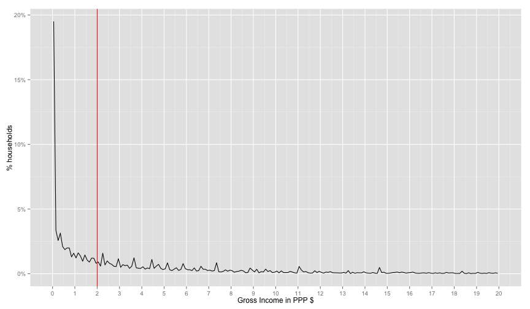 

There's a strange spike at the start of the distribution. This looks fishy. So 
let's find exactly how how many are 0.0 income


```r
sum(household$INC_TOT_G_PPP_DAILY == 0.0) / nrow(household)
```

```
## [1] 0.1600092
```
16% don't have income variable. This makes the income variable useless for our usecase. Therefore,
let's move to expendtuires.


```r
# EXPENDTIURES
if('PCEXPDR_PPP' %in% names(household)){ # for Ghana
  #household$XPOV = household$PCEXP / expenses$PPP2005 / 365
  household$XPOV = household$PCEXPDR_PPP / 365

}else{ # for  Ethiopia
  household$XPOV = household$PCEXP_PPP / 365
}

distPlot = ggplot(household, aes(x=XPOV, nrow=nrow(household), y=..count.. / nrow)) +
  geom_line(stat='bin', binwidth=0.1) + scale_y_continuous(labels = percent_format()) + 
  geom_vline(xintercept=2.0, color='red')
distPlot + scale_x_continuous(limits=c(0, 20), breaks=0:20)  + labs(x='Total Expendtuires $', y='% households')
```

```
## Warning: Removed 2 rows containing missing values (geom_path).
```

 

Distribution looks much better than income. Let's make sure of 0.0 values

```r
sum(household$XPOV == 0.0) / nrow(household)
```

```
## [1] 0.005755727
```

But we are interested in the ratio of people *under* a certain PPP. So we use cumulative
sum `cumsum`


```r
distPlot + aes(y=cumsum(..count..)/nrow) + scale_x_continuous(limits=c(0, 20), breaks=0:20)  +
labs(x='Gross Income in PPP $', y='Cumulative % of households') +
geom_hline(yintercept=0.51, color='red')
```

```
## Warning: Removed 2 rows containing missing values (geom_path).
```

 

Their percentage from the worldbank is 51% for Ghanda. It seems that expenditures 
values are shifted from the world bank income for ghana. 
(I read somewhere that expenditures are mainly used for ranking, so it's a ranking preserving 
value).
So let's choose the number that will make the world bank's 51% fit our graph. I will hack 
this part very quickly. It seems from the graph that the 51% is around 3.5, assuming that
the extreme poverty line will be moved by the same factor (2.5/3.5) `1.75`, so the blue
line will be move to 1.25 * 1.75 `2.18`


```r
# VISUAL ROUGH CALCULATION (just multiplied the hlines by a factor)
distPlot + aes(y=cumsum(..count..)/nrow) + scale_x_continuous(limits=c(0, 20), breaks=0:20)  +
labs(x='Gross Income in PPP $', y='Cumulative % of households') +
geom_hline(yintercept=0.51, color='red') + 
geom_hline(yintercept=0.28, color='blue') + 
geom_vline(xintercept=3.5, color='red') + geom_vline(xintercept=2.18, color='blue')
```

```
## Warning: Removed 2 rows containing missing values (geom_path).
```

 

Ok, too much hacking for this part. It seems like a good enough fit. At this 
point, I don't really know why the income data is missing so many values and whether 
this factor-shift makes any sense. But we at least now have a proper ranking of households
and looks-sane distribution with the right percentage of poor according to the world 
bank. I guess this is good enough for classifier experiment pipeline as the data about
the household and the house roster are still identifiable.

So Let's label the poor then.


```r
household$poor = factor(household$XPOV < 3.5)
# for households levels
table(household$poor)
```

```
## 
## FALSE  TRUE 
##  4227  4460
```

```r
sum(household$poor == TRUE, na.rm=T) / nrow(household)
```

```
## [1] 0.5134108
```

Whoops, let's keep in mind that we are dealing with two levels here. The household level
and the individual level. World's bank 51% number is % of headcount. Our shift didn't take 
that into consideration. Because if we want to get the headcount we need to count all the people
in the poor household. This can be done as follows.


```r
# for individuals levels
sum(household$poor == T * household$HHSIZE, na.rm=T) / sum(household$HHSIZE)
```

```
## [1] 0
```

Ouch, 65% of the headcount are poor. (won't go through it in the report). I 
found an alternative shift factor to make %headcount 51% instead of this overestimate. I
won't go through this in the report. It was `1.35` (moving the poverty line from
2$ to 2.7$). Let's label again and check this


```r
household$poor = factor(household$XPOV < 2.7)
# for households levels
table(household$poor)
```

```
## 
## FALSE  TRUE 
##  5386  3301
```

```r
sum(household$poor == T, na.rm=T) / nrow(household)
```

```
## [1] 0.3799931
```

```r
sum(household$poor == T * household$HHSIZE, na.rm=T) / sum(household$HHSIZE)
```

```
## [1] 0
```
This means that 51% of the population is poor and this 51% lives in 38% of the households.

Let's move to the classification then. 


## Classifiers

### Variable Relations

Let's go through some basic classifier usage on this example. First our data is now
labelled `household$poor`. Let's first examine the relation between some variables
and the dependant variable.


```r
# the default levels are 'YES', 'NO', let's change them to make the table more readble
levels(household$TV) = c('NOTV', 'TV')
table(household$poor, household$TV)
```

```
##        
##         NOTV   TV
##   FALSE 3334 2052
##   TRUE  2752  500
```

It actually seems like a signal. The ratio of poor people with TV is 0.1537515. 
While The ratio of non poor people with TV is 0.3809877.

Let's make a plot to visualize the relation between having a TV and the XPOV (expenditures per capita
in the house hold).


```r
tv_xpov = ggplot(subset(household, !is.na(TV)), aes(y=TV, x=XPOV, col=TV)) +
geom_point(alpha=0.5, position=position_jitter(0.05)) + geom_vline(xintercept=2.7, color='red')
tv_xpov
```

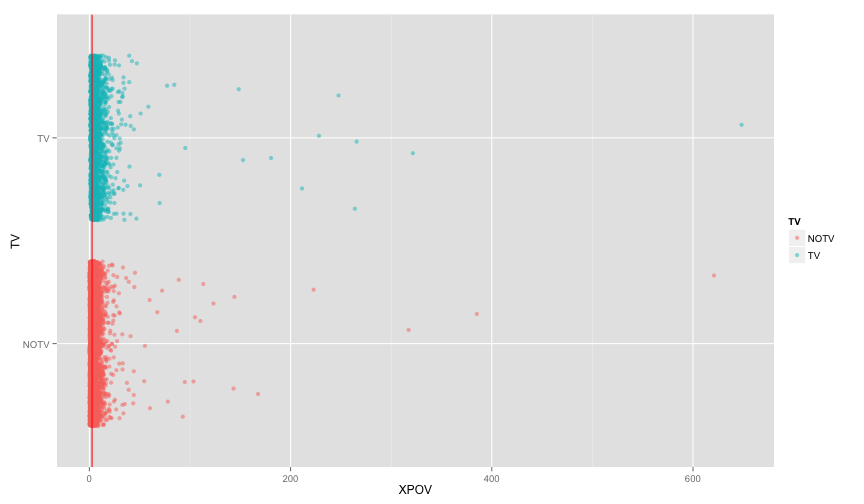 

Seems like we need to zoom in a bit


```r
tv_xpov + scale_x_continuous(limits=c(1,10)) 
```

```
## Warning: Removed 1484 rows containing missing values (geom_point).
```

 

### Data Division and Training 

Ok, let's actually build a classifier that only uses the TV column. This will make us 
go through many things. We'll divide the data into training, testing, and Cross Validation 
in a way that is fair regrind the dependant variable. We'll build the classifier, 
test and cross validate it on a certain parameter. And Maybe use some imputation to deal with 
missing data.


We'll use a couple of libraries for each step. First let's divide the data and make
a naive model and then print some info about our model.

```r
library(caTools) # for sampling
set.seed(2000) # to ensure consistent runs
split = sample.split(household$poor, SplitRatio=0.7)

# adding poor factorial
household$poorfac = factor(household$poor, levels=c('TRUE', 'FALSE'))
levels(household$poorfac) = c('POOR', 'NOT_POOR')

train.household = subset(household, split)
test.household = subset(household, !split)

# you can use '.' to refer to all variable or . - VAR1 - VAR2 to exclude some variables
logit1 = glm(poor ~ TV + TOILET, data=train.household, family=binomial)
summary(logit1)
```

```
## 
## Call:
## glm(formula = poor ~ TV + TOILET, family = binomial, data = train.household)
## 
## Deviance Residuals: 
##     Min       1Q   Median       3Q      Max  
## -1.4286  -0.9484  -0.6845   0.9455   2.0708  
## 
## Coefficients:
##                            Estimate Std. Error z value Pr(>|z|)    
## (Intercept)                -1.27184    0.12914  -9.849  < 2e-16 ***
## TVTV                       -0.74769    0.07473 -10.005  < 2e-16 ***
## TOILETImproved pit latrine  0.68771    0.13084   5.256 1.47e-07 ***
## TOILETPit latrine           0.70601    0.13512   5.225 1.74e-07 ***
## TOILETNo facility           1.84538    0.13815  13.358  < 2e-16 ***
## TOILETOther                 1.09912    0.25672   4.281 1.86e-05 ***
## ---
## Signif. codes:  0 '***' 0.001 '**' 0.01 '*' 0.05 '.' 0.1 ' ' 1
## 
## (Dispersion parameter for binomial family taken to be 1)
## 
##     Null deviance: 8010.5  on 6046  degrees of freedom
## Residual deviance: 7274.9  on 6041  degrees of freedom
##   (34 observations deleted due to missingness)
## AIC: 7286.9
## 
## Number of Fisher Scoring iterations: 4
```

Now let's test our model via the `test.household`


```r
logit1.poor.prediction = predict(logit1, newdata=test.household, type="response")
head(logit1.poor.prediction)
```

```
##         2         5         7         8         9        15 
## 0.1171677 0.3579820 0.2088580 0.2088580 0.3579820 0.3579820
```
Now we must choose a threshold to label our predicted value as poor or not. (We'll do it roughly now, then 
use a better analysis later).

Let's build the diffusion matrix with a threshold of 0.5


```r
table(prediction=logit1.poor.prediction > 0.5, reference = test.household$poor)
```

```
##           reference
## prediction FALSE TRUE
##      FALSE  1412  565
##      TRUE    204  410
```

```r
# or you can use the more polished way of confusionMatrix in caret library

library(caret)
```

```
## Loading required package: lattice
```

```r
library(e1071)

confusionMatrix(logit1.poor.prediction > 0.5, test.household$poor)
```

```
## Confusion Matrix and Statistics
## 
##           Reference
## Prediction FALSE TRUE
##      FALSE  1412  565
##      TRUE    204  410
##                                           
##                Accuracy : 0.7032          
##                  95% CI : (0.6852, 0.7207)
##     No Information Rate : 0.6237          
##     P-Value [Acc > NIR] : < 2.2e-16       
##                                           
##                   Kappa : 0.3176          
##  Mcnemar's Test P-Value : < 2.2e-16       
##                                           
##             Sensitivity : 0.8738          
##             Specificity : 0.4205          
##          Pos Pred Value : 0.7142          
##          Neg Pred Value : 0.6678          
##              Prevalence : 0.6237          
##          Detection Rate : 0.5450          
##    Detection Prevalence : 0.7630          
##       Balanced Accuracy : 0.6471          
##                                           
##        'Positive' Class : FALSE           
## 
```

So right now we're using an arbitrary threshold of 0.5. Let's use the ROC curve 
to choose a better value


```r
library(ROCR)
```

```
## Loading required package: gplots
## KernSmooth 2.23 loaded
## Copyright M. P. Wand 1997-2009
## 
## Attaching package: 'gplots'
## 
## The following object is masked from 'package:stats':
## 
##     lowess
```

```r
logit1.ROCRpred = prediction(logit1.poor.prediction, test.household$poor) # prediction object

perf = performance(logit1.ROCRpred, 'tpr', 'fpr')
rocplot = function(perf){
  qplot(perf@x.values[[1]], perf@y.values[[1]], geom='line') + labs(x=perf@x.name, y=perf@y.name, title=perf@alpha.name) # plot ROC
}
rocplot(perf)
```

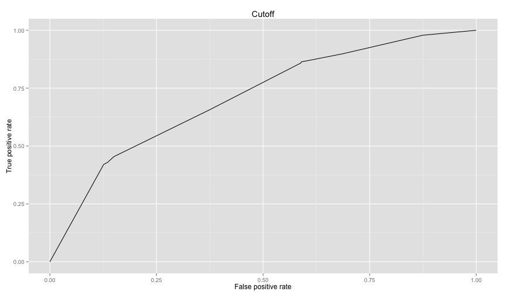 


To get the area under the curve we can use as well as other many performance metrics


```r
# this way you can get auc, precision, recall as values or as plots where the 
# the x axis is the cutoff and the xaxis is the metric. 
# to get the area under the curve
as.numeric(performance(logit1.ROCRpred, 'auc')@y.values)
```

```
## [1] 0.7104858
```

```r
# in helpers.R
drawPrecisionRecall(logit1.ROCRpred)
```

```
## Warning: Removed 1 rows containing missing values (geom_path).
```

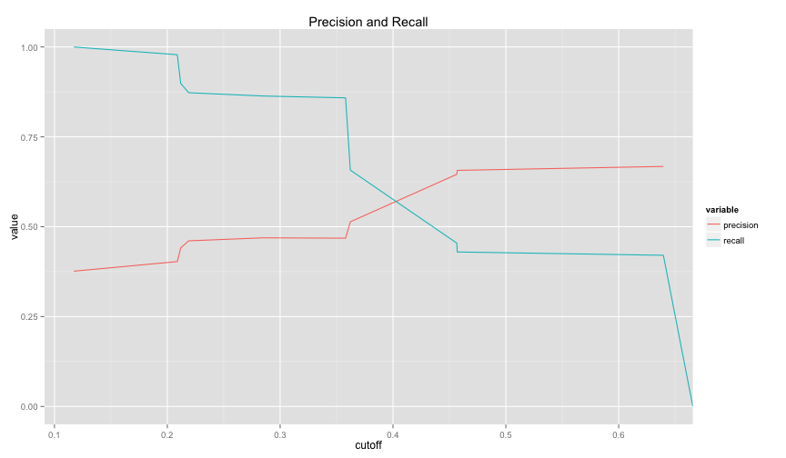 

Let's make a more realistic logistic regression model

To compare between logistic models we can use something similar to


```r
logit2 = glm(poor ~ WALLS + FLOOR + WATER + OWNHOUSE + ROOMS + ROOF, data=train.household, family=binomial) 
logit2.poor.prediction = predict(logit2, newdata=test.household, type="response")

logit2.ROCRpred = prediction(logit2.poor.prediction, test.household$poor) # prediction object
drawPrecisionRecall(logit2.ROCRpred)
```

```
## Warning: Removed 1 rows containing missing values (geom_path).
```

 

```r
confusionMatrix(logit2.poor.prediction > 0.4, test.household$poor)
```

```
## Confusion Matrix and Statistics
## 
##           Reference
## Prediction FALSE TRUE
##      FALSE  1039  371
##      TRUE    577  619
##                                           
##                Accuracy : 0.6362          
##                  95% CI : (0.6174, 0.6547)
##     No Information Rate : 0.6201          
##     P-Value [Acc > NIR] : 0.04668         
##                                           
##                   Kappa : 0.2578          
##  Mcnemar's Test P-Value : 2.774e-11       
##                                           
##             Sensitivity : 0.6429          
##             Specificity : 0.6253          
##          Pos Pred Value : 0.7369          
##          Neg Pred Value : 0.5176          
##              Prevalence : 0.6201          
##          Detection Rate : 0.3987          
##    Detection Prevalence : 0.5411          
##       Balanced Accuracy : 0.6341          
##                                           
##        'Positive' Class : FALSE           
## 
```

```r
logit1.auc = performance(logit1.ROCRpred, 'auc')
logit2.auc = performance(logit2.ROCRpred, 'auc')
logit1.auc@y.values[[1]]
```

```
## [1] 0.7104858
```

```r
logit2.auc@y.values[[1]]
```

```
## [1] 0.6916657
```

```r
logit1.tpr.fpr = performance(logit1.ROCRpred, 'tpr', 'fpr')
logit2.tpr.fpr = performance(logit2.ROCRpred, 'tpr', 'fpr')

# not the cleanest way, but will make generating graphs for exploring much much better
df1 = data.frame(logit1.x = logit1.tpr.fpr@x.values[[1]], logit1.y = logit1.tpr.fpr@y.values[[1]])
df2 = data.frame(logit2.x = logit2.tpr.fpr@x.values[[1]], logit2.y = logit2.tpr.fpr@y.values[[1]])
ggplot(df1, aes(x = logit1.x, y=logit1.y)) +
  geom_line() +
  geom_line(data=df2, aes(logit2.x, logit2.y), color='red') +
  labs(title="Comparison between logit1 and logit2", x='False Positive Rate', y='True Positive Rate')
```

 

The above code is packaged in `compareTwoModels` method in helpers.R, you can call it easily as follows


```r
compareTwoModels(logit1, logit2, test.data=test.household, dep.var='poor',
                 model1.name='logit1', model2.name='logit2')
```

 
logit2 is not performing well against logi1. Let's see what are the significant
variables in logit2. (note the stars).


```r
  summary(logit2)
```

```
## 
## Call:
## glm(formula = poor ~ WALLS + FLOOR + WATER + OWNHOUSE + ROOMS + 
##     ROOF, family = binomial, data = train.household)
## 
## Deviance Residuals: 
##     Min       1Q   Median       3Q      Max  
## -2.3546  -0.9598  -0.6875   1.1449   2.1494  
## 
## Coefficients:
##                           Estimate Std. Error z value Pr(>|z|)    
## (Intercept)               -1.85240    0.17595 -10.528  < 2e-16 ***
## WALLSWood                  0.19038    0.26260   0.725  0.46846    
## WALLSBamboo/thach          0.46639    0.70572   0.661  0.50869    
## WALLSIron/metal sheets     0.56924    0.07430   7.661 1.84e-14 ***
## WALLSClay/mud             -0.65639    1.16443  -0.564  0.57296    
## WALLSMakeshift             1.87340    0.95974   1.952  0.05094 .  
## WALLSOther                 1.03339    0.77565   1.332  0.18276    
## FLOORWood/bamboo          -0.38880    0.53543  -0.726  0.46775    
## FLOORVinyl                -0.83331    0.55164  -1.511  0.13089    
## FLOOREarth/clay/mud        0.07337    0.08245   0.890  0.37353    
## FLOOROther               -12.63467  324.74370  -0.039  0.96896    
## WATERPublic standpipe      0.23185    0.10171   2.280  0.02264 *  
## WATERBorehole              0.67544    0.10104   6.685 2.31e-11 ***
## WATERWells (protected)     0.36440    0.13818   2.637  0.00836 ** 
## WATERWells (unprotected)   0.62804    0.15530   4.044 5.25e-05 ***
## WATERSurface water         0.21219    0.11772   1.802  0.07148 .  
## WATERRain water           -0.21713    0.37623  -0.577  0.56387    
## WATERVendor/truck         -0.65162    0.21267  -3.064  0.00218 ** 
## WATEROther                 2.69588    1.13178   2.382  0.01722 *  
## OWNHOUSEYes                0.16104    0.06452   2.496  0.01256 *  
## ROOMS                      0.21674    0.02414   8.977  < 2e-16 ***
## ROOFWood                   0.49828    0.47179   1.056  0.29090    
## ROOFBamboo/thach           0.25311    0.18659   1.356  0.17495    
## ROOFTiles/ Shingles        0.08180    0.16801   0.487  0.62635    
## ROOFTin/metal sheets       0.48004    0.18198   2.638  0.00834 ** 
## ROOFOther                 12.94935  159.94105   0.081  0.93547    
## ---
## Signif. codes:  0 '***' 0.001 '**' 0.01 '*' 0.05 '.' 0.1 ' ' 1
## 
## (Dispersion parameter for binomial family taken to be 1)
## 
##     Null deviance: 8076.6  on 6080  degrees of freedom
## Residual deviance: 7429.7  on 6055  degrees of freedom
## AIC: 7481.7
## 
## Number of Fisher Scoring iterations: 11
```


So let's do one more model, this time we'll use random forests with CV on one control parameter.


```r
library(randomForest)
```

```
## randomForest 4.6-10
## Type rfNews() to see new features/changes/bug fixes.
```

```r
# note in randomForests, NA values must be imputed or totally ignored 
#forest1 = randomForest(poor ~ HHSEX + HHAGEY + HHMARST + HHEDLEV + HHEMSTAT + HHEMTYPE  + OWNHOUSE+ ROOMS + GARBDISP + TOILET + WALLS +  SEWMACH + STOVE + RADIO + TV + AGLAND +  OTHLNDOW, data=train.household, nodesize=25, ntree=200)

forest1 = randomForest(poor ~ WALLS + FLOOR + WATER + OWNHOUSE + ROOMS + ROOF, data=train.household, nodesize=25, ntree=200)

# random forest models output TRUE or FALSE directly for classification. The models
# knew that it is a classification problem because the column poor is a factor. To
# Treat as response, make the poor column logical

# The predict function works here as well (there is an alias for each algorithm)
forest1.poor.prediction = predict(forest1, newdata=test.household)
confusionMatrix(forest1.poor.prediction, test.household$poor)
```

```
## Confusion Matrix and Statistics
## 
##           Reference
## Prediction FALSE TRUE
##      FALSE  1404  571
##      TRUE    212  419
##                                           
##                Accuracy : 0.6995          
##                  95% CI : (0.6815, 0.7171)
##     No Information Rate : 0.6201          
##     P-Value [Acc > NIR] : < 2.2e-16       
##                                           
##                   Kappa : 0.3141          
##  Mcnemar's Test P-Value : < 2.2e-16       
##                                           
##             Sensitivity : 0.8688          
##             Specificity : 0.4232          
##          Pos Pred Value : 0.7109          
##          Neg Pred Value : 0.6640          
##              Prevalence : 0.6201          
##          Detection Rate : 0.5388          
##    Detection Prevalence : 0.7579          
##       Balanced Accuracy : 0.6460          
##                                           
##        'Positive' Class : FALSE           
## 
```

### Merging with Data from Another Table (Feature Augmentation)

Because some features that might be useful aren't readily available from the household
table like the ratio for household resident under a certain age, we will need to aggregate
this kind of data from the individual data and merge it with the household table to be 
able to use in our classifiers.


```r
library(plyr)
```

```
## 
## Attaching package: 'plyr'
## 
## The following objects are masked from 'package:reshape':
## 
##     rename, round_any
```

```r
all_info = ddply(individuals, .(HID), function(x){ 
                c(
                  sum(x$AGEY < 6) / x[1,]$HHSIZE_S, 
                  sum(x$AGEY < 15) / x[1,]$HHSIZE_S, 
                  sum(x$AGEY < 21) / x[1,]$HHSIZE_S,
                  sum(x$AGEY > 60) / x[1,]$HHSIZE_S,
                  sum(x$SEX == 'Female') / x[1,]$HHSIZE_S,
                  sum(x$LITERACY == 'Cannot read or write') / x[1,]$HHSIZE_S
                )
                 })
names(all_info) = c('HID', 'UND6RAT', 'UND15RAT', 'UND21RAT', 'ABV60RAT', 'FEMRAT', 'LITRAT')
extra.household = merge(all_info, household, by='HID')
```

Let's use the extra info in a forest classifier and compare the two models

```r
train.extra.household = extra.household[split, ]
test.extra.household = extra.household[!split, ]

forest1 = randomForest(poor ~ WALLS + FLOOR + WATER + OWNHOUSE + ROOMS + ROOF, data=train.extra.household) 

forest2 = randomForest(poor ~ UND6RAT + FEMRAT + WALLS + FLOOR + WATER + OWNHOUSE + ROOMS + ROOF, data=train.extra.household) 
logit3 = glm(poor ~ UND6RAT + FEMRAT + WALLS + FLOOR + WATER + OWNHOUSE + ROOMS + ROOF, data=train.extra.household, family=binomial) 
```
### Imputation Example and Dealing with Missing Data

Some data is missing, but it is not much, (I investigated quickly offline)


```r
library('mice')
povCols = c('HHSEX', 'HHAGEY', 'HHMARST', 'HHEDLEV', 'HHEMTYPE', 'OWNHOUSE',  'ROOMS', 'GARBDISP', 'TOILET', 'WALLS', 'SEWMACH', 'STOVE', 'RADIO', 'TV', 'AGLAND', 'OTHLNDOW', 'poor')

subset.household = household[, povCols]

subset.train.household  = subset(subset.household, split)
subset.test.household  = subset(subset.household, !split)

logit4 = glm(poor ~ ., subset.train.household, family=binomial)

# takes a lot of time, not worth it
# imputed.household = complete(mice(household[, povCols]))
imputed.household = household

imputed.train.household = subset(imputed.household, split)
imputed.test.household = subset(imputed.household, !split)

logit4 = glm(poor ~ ., imputed.train.household, family=binomial)
```

```
## Error in `contrasts<-`(`*tmp*`, value = contr.funs[1 + isOF[nn]]): contrasts can be applied only to factors with 2 or more levels
```

```r
logit4.poor.prediction = predict(logit4, imputed.test.household)
table(prediction=logit4.poor.prediction > 0.4, reference = imputed.test.household$poor)
```

```
##           reference
## prediction FALSE TRUE
##      FALSE   705  377
##      TRUE    119  350
```

#### SVM model


```r
library(kernlab)
```

```
## 
## Attaching package: 'kernlab'
## 
## The following object is masked from 'package:scales':
## 
##     alpha
```

```r
svm1 = ksvm(poor ~ WALLS + FLOOR + WATER + OWNHOUSE + ROOMS + ROOF, data=train.extra.household)
```

```
## Using automatic sigma estimation (sigest) for RBF or laplace kernel
```

```r
svm1.predictions = predict(svm1, test.extra.household)
confusionMatrix(svm1.predictions, test.extra.household$poor)
```

```
## Confusion Matrix and Statistics
## 
##           Reference
## Prediction FALSE TRUE
##      FALSE  1418  595
##      TRUE    198  395
##                                           
##                Accuracy : 0.6957          
##                  95% CI : (0.6776, 0.7133)
##     No Information Rate : 0.6201          
##     P-Value [Acc > NIR] : 4.096e-16       
##                                           
##                   Kappa : 0.2997          
##  Mcnemar's Test P-Value : < 2.2e-16       
##                                           
##             Sensitivity : 0.8775          
##             Specificity : 0.3990          
##          Pos Pred Value : 0.7044          
##          Neg Pred Value : 0.6661          
##              Prevalence : 0.6201          
##          Detection Rate : 0.5441          
##    Detection Prevalence : 0.7724          
##       Balanced Accuracy : 0.6382          
##                                           
##        'Positive' Class : FALSE           
## 
```

```r
svm3 = ksvm(poor ~ UND6RAT + FEMRAT + WALLS + FLOOR + WATER + OWNHOUSE + ROOMS + ROOF, data=train.extra.household) 
```

```
## Using automatic sigma estimation (sigest) for RBF or laplace kernel
```

```r
svm3.predictions = predict(svm3, test.extra.household)
confusionMatrix(svm3.predictions, test.extra.household$poor)
```

```
## Confusion Matrix and Statistics
## 
##           Reference
## Prediction FALSE TRUE
##      FALSE  1396  538
##      TRUE    220  452
##                                           
##                Accuracy : 0.7091          
##                  95% CI : (0.6913, 0.7265)
##     No Information Rate : 0.6201          
##     P-Value [Acc > NIR] : < 2.2e-16       
##                                           
##                   Kappa : 0.3417          
##  Mcnemar's Test P-Value : < 2.2e-16       
##                                           
##             Sensitivity : 0.8639          
##             Specificity : 0.4566          
##          Pos Pred Value : 0.7218          
##          Neg Pred Value : 0.6726          
##              Prevalence : 0.6201          
##          Detection Rate : 0.5357          
##    Detection Prevalence : 0.7421          
##       Balanced Accuracy : 0.6602          
##                                           
##        'Positive' Class : FALSE           
## 
```


### Cross Validation and Tuning Example 
In this example we'll make a tree model and tune it using caret library. Caret
( Classification and Regression Training) is the gold standard for tuning models
in R. We'll play with a gbm model and an svm model. (I commented the code because
a better examples are in the Feature Analysis section).


```r
# fitControl <- trainControl(## 10-fold CV
#                            method = "repeatedcv",
#                            number = 10,
#                            ## repeated ten times
#                            repeats = 5)
# 
# 
# gbmFit1 <- train(poor ~ UND6RAT + FEMRAT + WALLS + FLOOR + WATER + OWNHOUSE + ROOMS + ROOF,
#                  data = train.extra.household,
#                  method = "gbm",
#                  trControl = fitControl,
#                  ## This last option is actually one
#                  ## for gbm() that passes through
#                  verbose = FALSE)
# gbmFit1
# 


# svmFit1 <- train(poor ~ UND6RAT + FEMRAT + WALLS + FLOOR + WATER + OWNHOUSE + ROOMS + ROOF,
#                  data = train.extra.household,
#                  method = "svmRadial",
#                  trControl = fitControl,
#                  tuneLength = 8)
# svmFit1


# descrimination 
# rdaFit1 <- train(poor ~ UND6RAT + FEMRAT + WALLS + FLOOR + WATER + OWNHOUSE + ROOMS + ROOF,
#                  data = train.extra.household,
#                  method = "rda",
#                  trControl = fitControl,
#                  tuneLength = 4,
#                  metric = "ROC")
# rdaFit
# 
# 
# 
# logFit1 <- train(poor ~ UND6RAT + FEMRAT + WALLS + FLOOR + WATER + OWNHOUSE + ROOMS + ROOF,
#                  data = train.extra.household,
#                  method = "LogitBoost",
#                  trControl = fitControl)
# logFit1
```


## Feature Analysis and New Models
Let's analyze a bit how some variables that we choose in our models relate to the
likelihood of being poor.


```r
ggplot(extra.household, aes(x=TOILET, fill=poorfac)) + geom_bar(position='fill') + coord_flip()
```

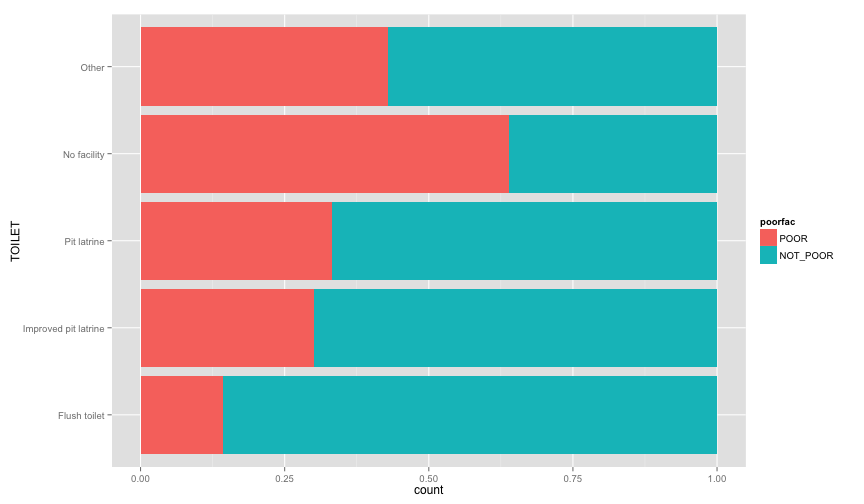 

```r
ggplot(extra.household, aes(x=TV, fill=poorfac)) + geom_bar(position='fill') + coord_flip()
```

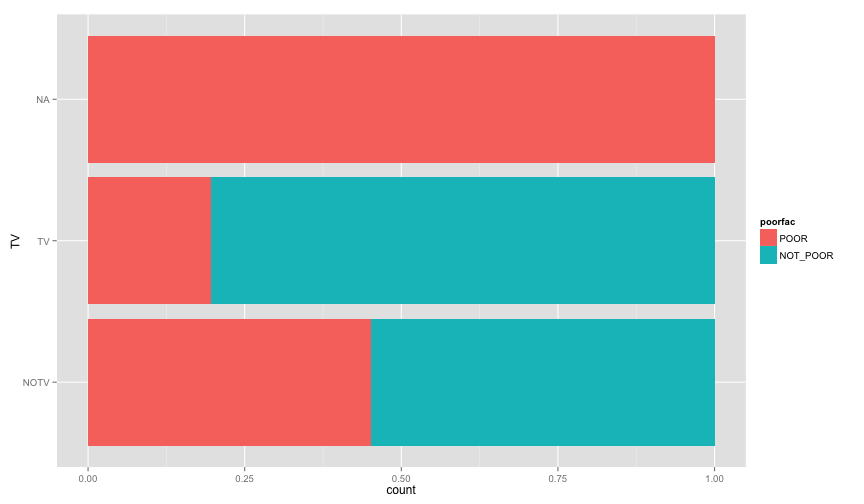 

```r
ggplot(extra.household, aes(x=GARBDISP, fill=poorfac)) + geom_bar(position='fill') + ggtitle('Grabage disposal') + coord_flip()
```

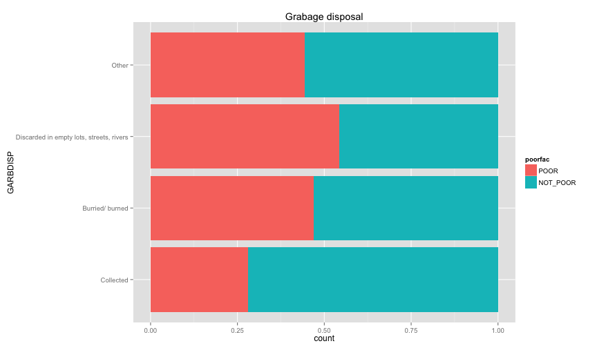 

```r
ggplot(extra.household, aes(x=SEWMACH, fill=poorfac)) + geom_bar(position='fill') + ggtitle('Sewing machine') + coord_flip()
```

 

```r
ggplot(extra.household, aes(x=WALLS, fill=poorfac)) + geom_bar(position='fill') + coord_flip()
```

 

```r
ggplot(extra.household, aes(x=STOVE, fill=poorfac)) + geom_bar(position='fill') + coord_flip()
```

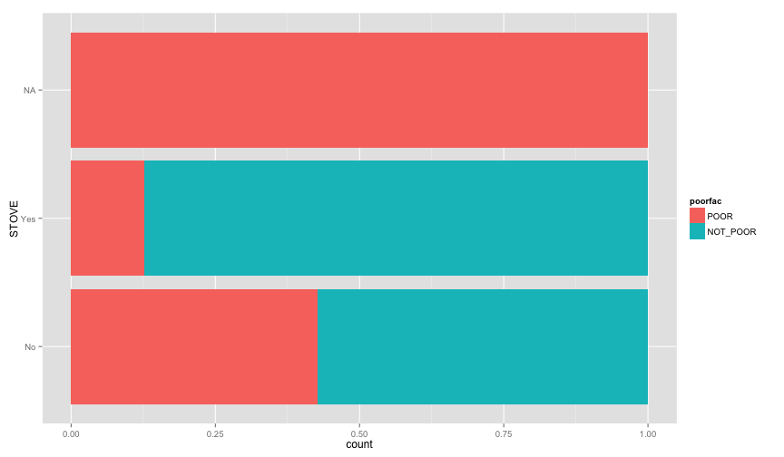 

```r
ggplot(extra.household, aes(x=RADIO, fill=poorfac)) + geom_bar(position='fill') + coord_flip()
```

 
There is an obvious relation between these variables and the likelihood of being poor. 
Let's examine more household related variables


```r
ggplot(extra.household, aes(x=HHAGEY, fill=poorfac)) + geom_bar(position='fill') + ggtitle('Household Head Age') + coord_flip()
```

```
## stat_bin: binwidth defaulted to range/30. Use 'binwidth = x' to adjust this.
```

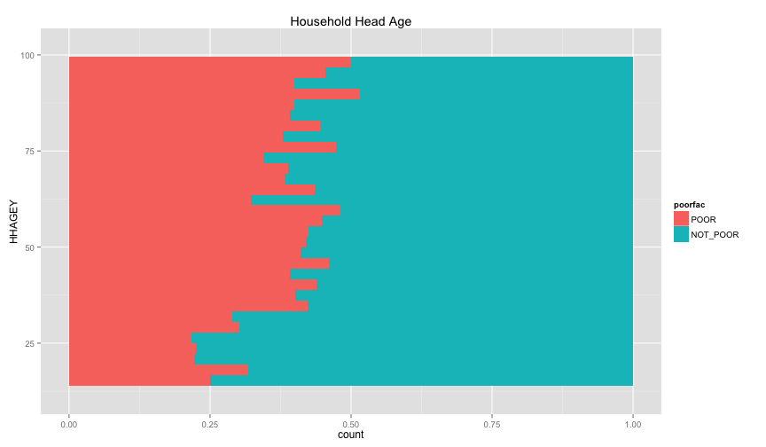 

```r
ggplot(extra.household, aes(x=HHSEX, fill=poorfac)) + geom_bar(position='fill') + ggtitle('Household Head Sex') + coord_flip()
```

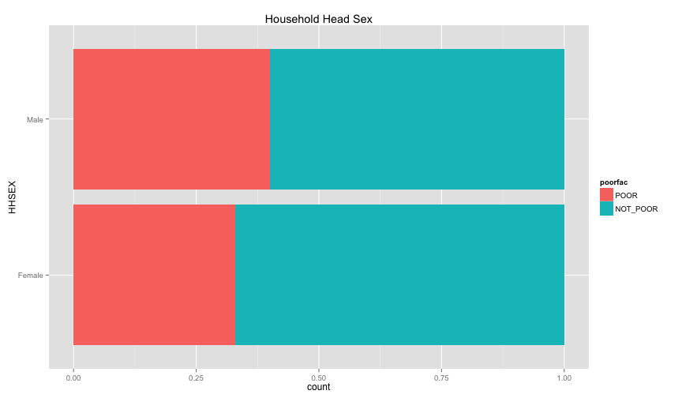 

```r
ggplot(extra.household, aes(x=HHMARST, fill=poorfac)) + geom_bar(position='fill') + ggtitle('Household Head Martial Status') + theme(axis.text.x = element_text(angle = 90, hjust = 1)) + coord_flip()
```

 

```r
ggplot(extra.household, aes(x=HHEDLEV, fill=poorfac)) + geom_bar(position='fill') + ggtitle('Household Head Ed level') + scale_x_discrete(labels= c('No Education', 'Pre school', 'Primary', 'Secondary', 'Upper secondary ', 'Post secondary (technical or vocational)', 'University', 'Literacy Program', 'Other', 'NA')) + theme(axis.text.x = element_text(angle = 90, hjust = 1)) + coord_flip()
```

 

```r
ggplot(extra.household, aes(x=OWNHOUSE, fill=poorfac)) + geom_bar(position='fill') + ggtitle('Is the house owned') + coord_flip()
```

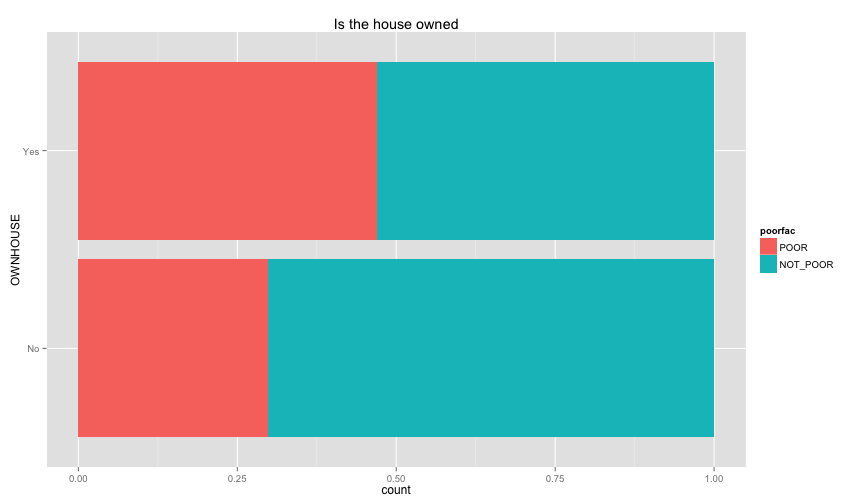 
Something really strange in the OWNHOUSE graph. It is counterintuitive that if you own a house, it's more likely that you 
are under the poverty line.

Let's examine the relation between the individual information that we extracted before (ratio of children
and ratio of female, and illiteracy ratio).


```r
ggplot(extra.household, aes(x=UND6RAT, fill=poorfac)) + geom_bar(position='fill', binwidth=0.1) + labs(title ='Under 6 ratio') + scale_x_continuous(limits=c(0.0, 1.0))
```

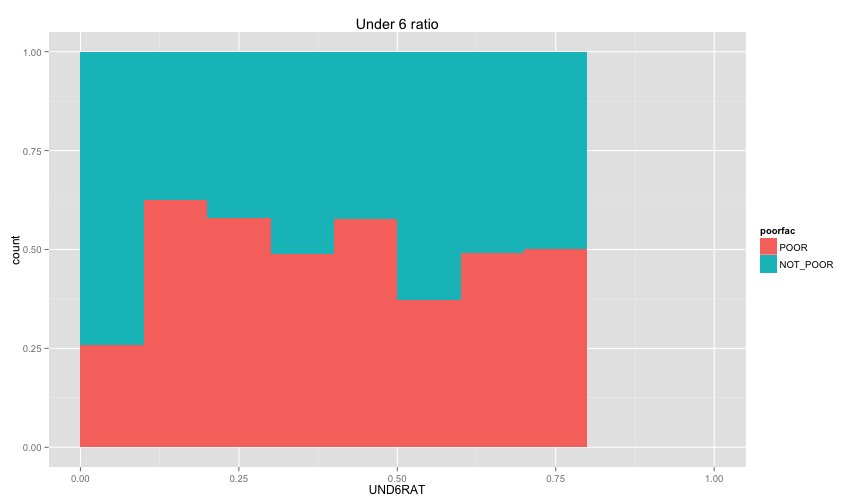 

```r
ggplot(extra.household, aes(x=UND15RAT, fill=poorfac)) + geom_bar(position='fill', binwidth=0.1) + labs(title = 'Under 15 ratio') + scale_x_continuous(limits=c(0.0, 1.0))
```

 

```r
ggplot(extra.household, aes(x=UND21RAT, fill=poorfac)) + geom_bar(position='fill', binwidth=0.1) + labs(title = 'Under 21 ratio') + scale_x_continuous(limits=c(0.0, 1.0))
```

 

```r
ggplot(extra.household, aes(x=ABV60RAT, fill=poorfac)) + geom_bar(position='fill', binwidth=0.1) + labs(title = 'Above 60 ratio') + scale_x_continuous(limits=c(0.0, 1.0))
```

 

```r
ggplot(extra.household, aes(x=FEMRAT, fill=poorfac)) + geom_bar(position='fill', binwidth=0.1) + labs(title = 'Female  ratio') + scale_x_continuous(limits=c(0.0, 1.0))
```

 

```r
ggplot(extra.household, aes(x=LITRAT, fill=poorfac)) + geom_bar(position='fill', binwidth=0.1) + labs(title = 'Illiteracy ratio') + scale_x_continuous(limits=c(0.0, 1.0))
```

 

**Note** Bar lengths are normalized to easily compare ratio. So something like the education level will look like
this if we ignored normalization. Note that I only delete the `position` argument in the geom_bar 


```r
ggplot(extra.household, aes(x=HHEDLEV, fill=poorfac)) + geom_bar() + ggtitle('Household Head Ed level') + scale_x_discrete(labels= c('No Education', 'Pre school', 'Primary', 'Secondary', 'Upper secondary ', 'Post secondary (technical or vocational)', 'University', 'Literacy Program', 'Other', 'NA')) + theme(axis.text.x = element_text(angle = 90, hjust = 1))
```

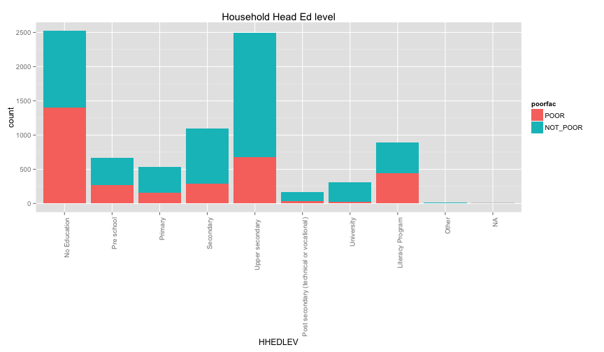 

```r
ggplot(extra.household, aes(x=LITRAT, fill=poorfac)) + geom_bar(binwidth=0.1) + labs(title = 'Illiteracy ratio') + scale_x_continuous(limits=c(0.0, 1.0))
```

 

Let's build model with some of those variables. We'll use caret to do the cross validation and rely 
on the accuracy metric `1/n(TP + TN)`


```r
fitControl <- trainControl(## 10-fold CV
                           method = "repeatedcv",
                           number = 10,
                           ## repeated ten times
                           repeats = 10)


#gbmFit1 <- train(poor ~ UND6RAT + FEMRAT + WALLS + FLOOR + WATER + OWNHOUSE + ROOMS + ROOF,
gbmFit1 <- train(poor ~ TOILET + TV + GARBDISP + STOVE + HHMARST + HHEDLEV + OWNHOUSE + UND15RAT  + UND21RAT  + FEMRAT +LITRAT,
                 data = train.extra.household,
                 method = "gbm",
                 trControl = fitControl,
                 ## This last option is actually one
                 ## for gbm() that passes through
                 verbose = FALSE)
```

```
## Loading required package: gbm
## Loading required package: survival
## Loading required package: splines
## 
## Attaching package: 'survival'
## 
## The following object is masked from 'package:caret':
## 
##     cluster
## 
## Loading required package: parallel
## Loaded gbm 2.1.1
```

```r
gbmFit1
```

```
## Stochastic Gradient Boosting 
## 
## 6081 samples
##  104 predictor
##    2 classes: 'FALSE', 'TRUE' 
## 
## No pre-processing
## Resampling: Cross-Validated (10 fold, repeated 10 times) 
## 
## Summary of sample sizes: 3057, 3057, 3058, 3057, 3057, 3057, ... 
## 
## Resampling results across tuning parameters:
## 
##   interaction.depth  n.trees  Accuracy   Kappa      Accuracy SD
##   1                   50      0.7808933  0.2662902  0.01358714 
##   1                  100      0.7860464  0.3033677  0.01462076 
##   1                  150      0.7873119  0.3225967  0.01447358 
##   2                   50      0.7847225  0.2988119  0.01427295 
##   2                  100      0.7891357  0.3343929  0.01430812 
##   2                  150      0.7893712  0.3414205  0.01543545 
##   3                   50      0.7868998  0.3114794  0.01495831 
##   3                  100      0.7881355  0.3351624  0.01507768 
##   3                  150      0.7870474  0.3382147  0.01572868 
##   Kappa SD  
##   0.05388886
##   0.05358377
##   0.05143455
##   0.05306729
##   0.05058441
##   0.05224141
##   0.05512640
##   0.05306251
##   0.05438589
## 
## Tuning parameter 'shrinkage' was held constant at a value of 0.1
## Accuracy was used to select the optimal model using  the largest value.
## The final values used for the model were n.trees = 150,
##  interaction.depth = 2 and shrinkage = 0.1.
```

With gradient boosting and without much tuning (except for basic tuning that caret does for tree-sizes), we were able to reach 79% accuracy!! 
Which is really good especially compared with the models we built earlier in this story (accuracy was in the 60s).
Comparing this with the performance of other datasets and algorithm here.


Let's try another set of variables that we choose before but this time we'll do the same cross validation procedure.


```r
gbmFit2 <- train(poor ~ UND6RAT + FEMRAT + WALLS + FLOOR + WATER + OWNHOUSE + ROOMS + ROOF,
                 data = train.extra.household,
                 method = "gbm",
                 trControl = fitControl,
                 ## This last option is actually one
                 ## for gbm() that passes through
                 verbose = FALSE)
gbmFit2
```

```
## Stochastic Gradient Boosting 
## 
## 6081 samples
##  104 predictor
##    2 classes: 'FALSE', 'TRUE' 
## 
## No pre-processing
## Resampling: Cross-Validated (10 fold, repeated 10 times) 
## 
## Summary of sample sizes: 5473, 5472, 5473, 5473, 5473, 5473, ... 
## 
## Resampling results across tuning parameters:
## 
##   interaction.depth  n.trees  Accuracy   Kappa      Accuracy SD
##   1                   50      0.6942132  0.3083537  0.01795626 
##   1                  100      0.7002974  0.3315723  0.01865515 
##   1                  150      0.7032080  0.3416662  0.01953760 
##   2                   50      0.7016296  0.3323030  0.01851439 
##   2                  100      0.7083549  0.3511137  0.01840383 
##   2                  150      0.7089310  0.3538746  0.01878544 
##   3                   50      0.7043097  0.3407625  0.01794083 
##   3                  100      0.7094243  0.3551364  0.01825492 
##   3                  150      0.7103122  0.3586861  0.01770997 
##   Kappa SD  
##   0.04094641
##   0.04179732
##   0.04312107
##   0.04192737
##   0.04164841
##   0.04241851
##   0.03979541
##   0.04055468
##   0.03986472
## 
## Tuning parameter 'shrinkage' was held constant at a value of 0.1
## Accuracy was used to select the optimal model using  the largest value.
## The final values used for the model were n.trees = 150,
##  interaction.depth = 3 and shrinkage = 0.1.
```

We got much lower accuracy. Making the selected variable ,from the basic feature analysis we did earlier, probable candidates
for the final model. And even comparable with what's happening in the literature. Not to forget the additions that came
from aggregating some data regarding the individuals of the each household and using them to predict the poverty of the household. Namely
UND15RAT  + UND21RAT  + FEMRAT + LITRAT which had significant difference in our last model.
